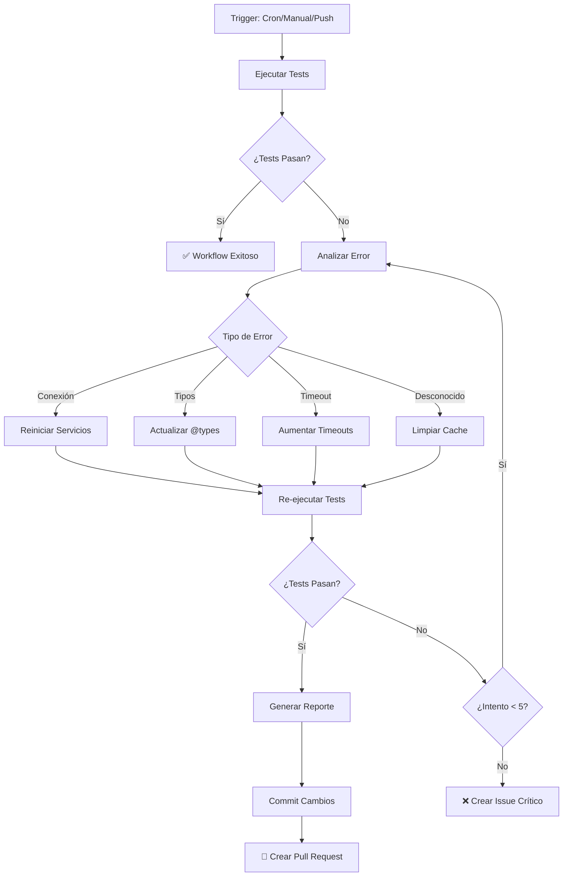

# 🛠️ Sistema de Auto-Corrección Inteligente

## Descripción General

Sistema autónomo que detecta y corrige automáticamente fallos en los tests del repositorio. Se ejecuta cada 4 horas y puede corregir problemas comunes sin intervención manual.

## Características Principales

✅ **Ejecución Automática**: Se ejecuta cada 4 horas mediante cron schedule  
✅ **Detección Inteligente**: Identifica 4 tipos de errores (conexión, tipos, timeout, desconocido)  
✅ **Corrección Específica**: Aplica soluciones apropiadas según el tipo de error detectado  
✅ **Sistema de Reintentos**: Hasta 5 intentos con estrategia de matriz  
✅ **Pull Request Automático**: Crea PR si la corrección es exitosa  
✅ **Issue Automático**: Crea issue crítico si todos los intentos fallan  

## Archivos del Sistema

### 1. Workflow Principal
**Ubicación**: `.github/workflows/auto-fix-tests.yml`

**Triggers**:
- Cada 4 horas (cron: `0 */4 * * *`)
- Manual con `workflow_dispatch`
- Push a la rama `main`

**Permisos Necesarios**:
- `contents: write` - Para commit de correcciones
- `pull-requests: write` - Para crear PRs
- `issues: write` - Para crear issues

### 2. Script de Diagnóstico
**Ubicación**: `scripts/diagnose-tests.js`

**Funcionalidad**:
- Ejecuta los tests
- Analiza el output en busca de patrones de error
- Genera reporte JSON con diagnóstico
- Proporciona sugerencias de corrección

### 3. Scripts npm
**Ubicación**: `package.json`

Scripts disponibles:
```bash
npm run diagnose        # Ejecutar diagnóstico de tests
npm run fix:connection  # Reiniciar servicios de conexión
npm run fix:types       # Actualizar definiciones de tipos
npm run fix:cache       # Limpiar cache y reinstalar
npm run fix:all         # Ejecutar todas las correcciones
```

## Tipos de Errores Detectados

### 1. 🔌 Errores de Conexión
**Patrones detectados**: `ECONNREFUSED`, `ETIMEDOUT`, `ENOTFOUND`

**Corrección aplicada**:
- Termina procesos de Firebase y Node.js
- Reinicia Firebase Emulator (si está instalado)
- Espera 20 segundos para estabilización

### 2. 📝 Errores de Tipos
**Patrones detectados**: `TypeError`, `ReferenceError`, `SyntaxError`

**Corrección aplicada**:
- Actualiza `@types/node` a la última versión
- Actualiza `@types/react` a la última versión
- Reinstala dependencias con `--force`

### 3. ⏱️ Errores de Timeout
**Patrones detectados**: `TIMEOUT`, `timeout`

**Corrección aplicada**:
- Aumenta `testTimeout` a 30000ms en vitest.config.js
- Aumenta `testTimeout` a 30000ms en vitest.config.ts (si existe)

### 4. ❓ Errores Desconocidos
**Patrones**: No coincide con ninguno de los anteriores

**Corrección aplicada**:
- Limpia cache de npm completamente
- Elimina `node_modules` y `package-lock.json`
- Reinstala todas las dependencias desde cero

## Flujo de Trabajo



## Uso del Sistema

### Ejecución Manual
```bash
# Desde GitHub Actions UI
1. Ir a Actions > 🛠️ Auto-Corrección Inteligente
2. Click en "Run workflow"
3. Seleccionar rama
4. Click en "Run workflow"
```

### Diagnóstico Local
```bash
# Ejecutar diagnóstico
npm run diagnose

# Ver resultado
cat test-diagnostics.json
```

### Aplicar Correcciones Manuales
```bash
# Corrección específica por tipo
npm run fix:connection  # Problemas de conexión
npm run fix:types      # Problemas de tipos
npm run fix:cache      # Limpiar cache

# Todas las correcciones
npm run fix:all
```

## Salidas del Sistema

### Pull Request Exitoso
Cuando una corrección es exitosa, se crea un PR con:
- Título: `🛠️ Auto-corrección aplicada (intento X/5)`
- Descripción detallada del error y la corrección
- Archivo `AUTO_FIX_REPORT.md` con reporte completo
- Cambios aplicados committeados

### Issue de Fallo
Cuando todos los intentos fallan, se crea un issue con:
- Título: `🚨 Auto-corrección falló después de 5 intentos`
- Labels: `bug`, `auto-fix-failed`, `critical`
- Descripción del error y todas las acciones intentadas
- Link a los logs del workflow

## Archivos Temporales

Los siguientes archivos se generan durante la ejecución pero están en `.gitignore`:
- `test-diagnostics.json` - Diagnóstico de errores
- `test-output.log` - Output completo de los tests
- `AUTO_FIX_REPORT.md` - Reporte de corrección (solo en PRs)

## Configuración Avanzada

### Modificar Frecuencia de Ejecución
Editar `.github/workflows/auto-fix-tests.yml`:
```yaml
schedule:
  - cron: '0 */4 * * *'  # Cada 4 horas
  # Ejemplos:
  # - cron: '0 */2 * * *'  # Cada 2 horas
  # - cron: '0 0 * * *'    # Cada día a medianoche
  # - cron: '0 */6 * * *'  # Cada 6 horas
```

### Añadir Nuevos Tipos de Error
1. Editar el paso "🔍 Analizar tipo de error"
2. Añadir nuevo patrón de detección:
```bash
elif grep -qi "NUEVO_PATRON" test-output.log; then
  echo "ERROR_TYPE=nuevo_tipo" >> $GITHUB_ENV
  echo "🆕 Nuevo tipo de error detectado"
```
3. Crear nuevo paso de corrección:
```yaml
- name: 🛠️ Corrección - Nuevo Tipo
  if: env.ERROR_TYPE == 'nuevo_tipo' && matrix.retry < 5
  run: |
    echo "🔧 Aplicando corrección personalizada..."
    # Comandos de corrección
```

### Ajustar Número de Reintentos
Modificar la matriz de estrategia:
```yaml
strategy:
  matrix:
    retry: [1, 2, 3, 4, 5, 6, 7]  # Aumentar a 7 intentos
```

## Mejores Prácticas

1. **Revisar PRs Automáticos**: Aunque el sistema corrige automáticamente, siempre revisa los cambios antes de hacer merge
2. **Monitorear Issues**: Los issues críticos requieren atención inmediata
3. **Actualizar Patrones**: Añade nuevos patrones de error según surjan
4. **Logs de Workflow**: Revisa los logs para entender qué correcciones se aplicaron
5. **Configuración Local**: Usa `npm run diagnose` localmente antes de pushear

## Troubleshooting

### El workflow no se ejecuta
- Verificar que el cron schedule esté configurado
- Verificar permisos de GitHub Actions en Settings
- Verificar que no hay límites de ejecución alcanzados

### Las correcciones no se aplican
- Verificar que los patrones de error coinciden
- Verificar permisos de write en el repositorio
- Revisar logs del workflow para ver errores

### No se crea el PR
- Verificar token `GITHUB_TOKEN` tiene permisos
- Verificar que peter-evans/create-pull-request@v5 está disponible
- Revisar que hay cambios para committear

### No se crea el issue
- Verificar que `gh` CLI está disponible
- Verificar permisos de issues:write
- Verificar formato del comando gh issue create

## Seguridad

✅ **CodeQL**: Analizado sin vulnerabilidades  
✅ **Secrets**: No usa secrets hardcodeados  
✅ **Permisos**: Mínimos necesarios (contents, pull-requests, issues)  
✅ **Dependencias**: Usa acciones oficiales de GitHub  

## Limitaciones

- Solo detecta errores con patrones conocidos
- Requiere que el error sea reproducible
- No puede resolver conflictos de merge
- Limitado a 5 intentos por ejecución
- Depende de GitHub Actions runners

## Contribuir

Para mejorar el sistema:
1. Añade nuevos patrones de error
2. Mejora las estrategias de corrección
3. Añade más validaciones
4. Documenta casos de uso específicos

## Soporte

Para problemas o sugerencias:
- Crear issue con label `auto-fix`
- Incluir logs del workflow
- Describir el tipo de error no detectado

---

**Versión**: 1.0.0  
**Última actualización**: 2025-11-14  
**Mantenedor**: GitHub Copilot Coding Agent
