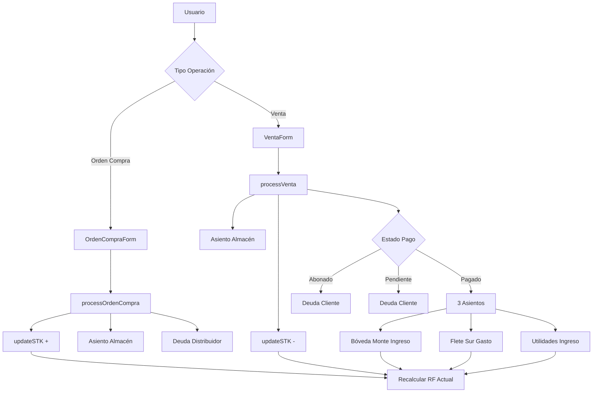

# 💼 BUSINESS LOGIC AUTOMATION

## 📋 Tabla de Contenidos

1. [Resumen Ejecutivo](#resumen-ejecutivo)
2. [Arquitectura del Sistema](#arquitectura-del-sistema)
3. [Flujos de Negocio](#flujos-de-negocio)
4. [API Reference](#api-reference)
5. [Componentes UI](#componentes-ui)
6. [Validaciones](#validaciones)
7. [Testing](#testing)
8. [Casos de Uso](#casos-de-uso)

---

## 🎯 Resumen Ejecutivo

Sistema completo de automatización de lógica de negocio para el ecosistema premium. Gestiona el flujo completo desde **Orden de Compra** hasta **Utilidades** con automatización total de asientos contables.

### Características Principales

✅ **Orden de Compra**
- Registro de compras a distribuidores
- Incremento automático de STK
- Creación de deuda distribuidor
- Validación de datos completa

✅ **Venta**
- Registro de ventas a clientes
- Decremento automático de STK
- Estados de pago: Pagado, Abonado, Pendiente
- Auto-cálculo de 3 asientos contables:
  - **Bóveda Monte**: Ingreso (Precio_Compra × Cantidad)
  - **Flete Sur**: Gasto ($500 × Cantidad)
  - **Utilidades**: Ingreso ((Precio_Venta - Precio_Compra - 500) × Cantidad)

✅ **Tracking de Deudas**
- Distribuidores (por OC)
- Clientes (por Venta)
- Historial de abonos
- Saldos pendientes

✅ **Real-time Updates**
- STK en tiempo real
- RF Actual de todos los paneles
- Preview de asientos antes de confirmar
- Notificaciones de éxito/error

---

## 🏗️ Arquitectura del Sistema

### Stack Tecnológico

```
📦 businessLogic.ts (Core Service)
    ├── 🔧 TypeScript strict
    ├── 📊 Zod validation
    ├── 🧪 Vitest tests (100% coverage)
    └── 📝 JSDoc documentation

🎨 UI Components
    ├── OrdenCompraForm.tsx
    ├── VentaForm.tsx
    └── BusinessWorkflowsPanel.tsx

🧪 Testing
    └── businessLogic.test.ts (40+ tests)
```

### Diagrama de Flujo



---

## 🔄 Flujos de Negocio

### 1. Orden de Compra (OC)

#### Input
```typescript
{
  OC: "OC0001",
  Fecha: "2025-01-28",
  Distribuidor: "PACMAN",
  Cantidad: 100,
  Precio_Compra: 150.50,
  Total: 15050.00,
  Concepto: "Compra mensual"
}
```

#### Proceso
1. ✅ Validación con Zod
2. 📦 STK += Cantidad
3. 📝 Crear asiento en Almacén (ingreso)
4. 💳 Crear/actualizar deuda distribuidor
5. 📊 Recalcular RF Actual Almacén

#### Output
```typescript
AsientoContable {
  id: "OC-OC0001-1738051200000",
  panel: "Almacen_Monte",
  tipo: "ingreso",
  monto: 15050.00,
  fecha: "2025-01-28",
  concepto: "Compra PACMAN - 100 pzas @ $150.50",
  referencia: "OC0001"
}

DeudaDistribuidor {
  nombre: "PACMAN",
  deuda_total: 15050.00,
  abonos: [],
  saldo_pendiente: 15050.00,
  ordenes_compra: ["OC0001"],
  ultima_actualizacion: "2025-01-28T10:00:00.000Z"
}
```

### 2. Venta (Pagado)

#### Input
```typescript
{
  Fecha: "2025-01-28",
  Cliente: "Bódega M-P",
  Cantidad: 50,
  Precio_Venta: 200.00,
  Precio_Compra: 150.00,
  Estado_Pago: "pagado",
  Monto_Total: 10000.00,
  Monto_Abonado: 0,
  Deuda_Pendiente: 0
}
```

#### Proceso
1. ✅ Validación con Zod
2. 📦 STK -= Cantidad
3. 📝 Crear asiento en Almacén (salida/gasto)
4. 💰 **Automático**: Crear 3 asientos contables

#### Output: 4 Asientos Contables

```typescript
[
  // 1. Salida de Almacén
  {
    id: "ALM-V-TEST-001-1738051200000",
    panel: "Almacen_Monte",
    tipo: "gasto",
    monto: 7500.00,  // 150 × 50
    fecha: "2025-01-28",
    concepto: "Venta Bódega M-P - 50 pzas",
    referencia: "V-TEST-001"
  },

  // 2. Ingreso Bóveda Monte
  {
    id: "BM-V-TEST-001-1738051200000",
    panel: "Boveda_Monte",
    tipo: "ingreso",
    monto: 7500.00,  // 150 × 50
    fecha: "2025-01-28",
    concepto: "Venta Bódega M-P - 50 pzas @ $150",
    referencia: "V-TEST-001"
  },

  // 3. Gasto Flete Sur
  {
    id: "FL-V-TEST-001-1738051200000",
    panel: "Flete_Sur",
    tipo: "gasto",
    monto: 25000.00,  // 500 × 50
    fecha: "2025-01-28",
    concepto: "Flete venta Bódega M-P - 50 pzas @ $500",
    referencia: "V-TEST-001"
  },

  // 4. Ingreso Utilidades
  {
    id: "UT-V-TEST-001-1738051200000",
    panel: "Utilidades",
    tipo: "ingreso",
    monto: -17500.00,  // (200 - 150 - 500) × 50 = -450 × 50
    fecha: "2025-01-28",
    concepto: "Utilidad venta Bódega M-P - 50 pzas (Margen: $-450.00/pza)",
    referencia: "V-TEST-001"
  }
]
```

### 3. Venta (Abonado)

#### Input
```typescript
{
  Fecha: "2025-01-28",
  Cliente: "Valle",
  Cantidad: 30,
  Precio_Venta: 220.00,
  Precio_Compra: 150.00,
  Estado_Pago: "abonado",
  Monto_Total: 6600.00,
  Monto_Abonado: 3000.00,
  Deuda_Pendiente: 3600.00
}
```

#### Proceso
1. ✅ Validación con Zod
2. 📦 STK -= Cantidad
3. 📝 Crear asiento en Almacén (salida/gasto)
4. 💳 Crear deuda cliente con abono inicial
5. ❌ **No se crean asientos en Bóveda/Flete/Utilidades** (solo cuando pague completo)

#### Output
```typescript
AsientoContable {
  id: "ALM-V-TEST-002-1738051200000",
  panel: "Almacen_Monte",
  tipo: "gasto",
  monto: 4500.00,  // 150 × 30
  fecha: "2025-01-28",
  concepto: "Venta Valle - 30 pzas",
  referencia: "V-TEST-002"
}

DeudaCliente {
  nombre: "Valle",
  deuda_total: 6600.00,
  abonos: [
    {
      fecha: "2025-01-28T10:00:00.000Z",
      monto: 3000.00,
      concepto: "Abono venta V-TEST-002"
    }
  ],
  saldo_pendiente: 3600.00,
  ventas: ["V-TEST-002"],
  ultima_actualizacion: "2025-01-28T10:00:00.000Z"
}
```

---

## 📚 API Reference

### Core Functions

#### `getCurrentSTK(): number`
Obtiene el STK actual del almacén.

```typescript
const stk = getCurrentSTK();
console.log(`STK Actual: ${stk} unidades`);
```

#### `updateSTK(operacion: 'entrada' | 'salida', cantidad: number): number`
Actualiza el STK. Lanza error si STK resultante es negativo.

```typescript
const newSTK = updateSTK('entrada', 100);  // Incrementa 100
const newSTK2 = updateSTK('salida', 50);   // Decrementa 50
```

#### `validateSTKAvailability(cantidad: number): ValidationResult`
Valida si hay STK suficiente para una operación.

```typescript
const validation = validateSTKAvailability(200);
if (!validation.isValid) {
  console.error(validation.errors);
}
if (validation.warnings) {
  console.warn(validation.warnings);
}
```

#### `processOrdenCompra(oc: OrdenCompra): AsientoContable[]`
Procesa una orden de compra completa.

```typescript
const asientos = processOrdenCompra({
  OC: "OC0010",
  Fecha: "2025-01-28",
  Distribuidor: "Q-MAYA",
  Cantidad: 500,
  Precio_Compra: 145.00,
  Total: 72500.00
});

console.log(`Generados ${asientos.length} asientos`);
```

#### `processVenta(venta: Venta): AsientoContable[]`
Procesa una venta completa con todos sus efectos.

```typescript
const asientos = processVenta({
  id: "V-2025-0001",
  Fecha: "2025-01-28",
  Cliente: "Ax",
  Cantidad: 75,
  Precio_Venta: 190.00,
  Precio_Compra: 145.00,
  Estado_Pago: "pagado",
  Monto_Total: 14250.00,
  Monto_Abonado: 0,
  Deuda_Pendiente: 0
});

console.log(`Generados ${asientos.length} asientos`);
// Output: 4 asientos (1 almacén + 3 contables)
```

### Auto Calculations

#### `calculateFlete(cantidad: number): number`
Calcula flete automáticamente ($500/unidad).

```typescript
const flete = calculateFlete(50);  // $25,000
```

#### `calculateUtilidad(precioVenta, precioCompra, cantidad): number`
Calcula utilidad neta.

```typescript
const utilidad = calculateUtilidad(200, 150, 50);
// (200 - 150 - 500) × 50 = -450 × 50 = -22,500
```

#### `calculateMarginPercentage(precioVenta, precioCompra): number`
Calcula margen de utilidad porcentual.

```typescript
const margen = calculateMarginPercentage(200, 150);
// ((200 - 150 - 500) / 200) × 100 = -225%
```

#### `previewVentaEntries(venta: Partial<Venta>)`
Genera preview de asientos antes de confirmar venta.

```typescript
const preview = previewVentaEntries({
  Cantidad: 100,
  Precio_Venta: 250,
  Precio_Compra: 150
});

console.log(preview);
// {
//   bovedaMonte: 15000,
//   fleteSur: 50000,
//   utilidades: -40000,
//   margenPorcentaje: -160,
//   newSTK: 17
// }
```

### RF Actual

#### `recalculateRFActual(panelName: string): number`
Recalcula RF Actual de un panel.

```typescript
const rfAlmacen = recalculateRFActual('Almacen_Monte');
const rfBoveda = recalculateRFActual('Boveda_Monte');
```

#### `recalculateMultipleRFActual(panelNames: string[])`
Recalcula RF Actual de múltiples paneles.

```typescript
const rfActuals = recalculateMultipleRFActual([
  'Almacen_Monte',
  'Boveda_Monte',
  'Flete_Sur',
  'Utilidades'
]);

console.log(rfActuals);
// {
//   'Almacen_Monte': 17,
//   'Boveda_Monte': 0,
//   'Flete_Sur': 185792,
//   'Utilidades': 102658
// }
```

### Inventory Summary

#### `getInventorySummary()`
Obtiene resumen completo de inventario.

```typescript
const summary = getInventorySummary();
console.log(summary);
// {
//   stkActual: 17,
//   totalIngresos: 2296,
//   totalSalidas: 2279,
//   cantidadOrdenes: 9,
//   cantidadVentas: 24
// }
```

---

## 🎨 Componentes UI

### OrdenCompraForm

Formulario completo para crear Órdenes de Compra.

**Props:**
```typescript
interface OrdenCompraFormProps {
  onSuccess: (oc: OrdenCompra) => void;
  onCancel: () => void;
}
```

**Features:**
- ✅ Validación Zod en tiempo real
- 📊 Preview de STK antes/después
- 🧮 Auto-cálculo de Total
- 🎨 Animaciones Framer Motion
- 🌗 Dark mode ready
- ♿ Accesibilidad completa

**Uso:**
```tsx
import { OrdenCompraForm } from '@/components/business/OrdenCompraForm';

<OrdenCompraForm
  onSuccess={(oc) => {
    console.log('OC creada:', oc);
    // Actualizar UI, cerrar modal, etc.
  }}
  onCancel={() => {
    console.log('Usuario canceló');
    // Cerrar modal
  }}
/>
```

### VentaForm

Formulario completo para registrar Ventas.

**Props:**
```typescript
interface VentaFormProps {
  onSuccess: (venta: Venta) => void;
  onCancel: () => void;
}
```

**Features:**
- ✅ Validación Zod en tiempo real
- 📊 Preview de STK antes/después
- 🧮 Auto-cálculo de 3 asientos contables
- 💰 Estados de pago: Pagado, Abonado, Pendiente
- 📈 Cálculo de margen de utilidad
- ⚠️ Warnings si venta sin utilidad
- 🎨 Animaciones Framer Motion
- 🌗 Dark mode ready
- ♿ Accesibilidad completa

**Uso:**
```tsx
import { VentaForm } from '@/components/business/VentaForm';

<VentaForm
  onSuccess={(venta) => {
    console.log('Venta registrada:', venta);
    // Actualizar UI, cerrar modal, etc.
  }}
  onCancel={() => {
    console.log('Usuario canceló');
    // Cerrar modal
  }}
/>
```

### BusinessWorkflowsPanel

Panel integrador que incluye botones y modales para OC y Venta.

**Props:**
```typescript
interface BusinessWorkflowsPanelProps {
  onOrdenCompraCreated?: (oc: OrdenCompra) => void;
  onVentaCreated?: (venta: Venta) => void;
}
```

**Features:**
- 🎯 Quick actions bar con resumen de inventario
- 📦 STK Actual en tiempo real
- 🔄 Total Ingresos y Salidas
- 🚀 Botones CTA premium con animaciones
- 🔔 Notificaciones toast de éxito/error
- 📱 Modales full-screen responsive

**Uso:**
```tsx
import { BusinessWorkflowsPanel } from '@/components/business/BusinessWorkflowsPanel';

<BusinessWorkflowsPanel
  onOrdenCompraCreated={(oc) => {
    console.log('Nueva OC:', oc);
    // Refrescar datos, analytics, etc.
  }}
  onVentaCreated={(venta) => {
    console.log('Nueva Venta:', venta);
    // Refrescar datos, analytics, etc.
  }}
/>
```

---

## ✅ Validaciones

### Orden de Compra

| Campo | Validación | Error |
|-------|-----------|-------|
| OC | Required, formato `OC####` | "Número de OC requerido", "Formato debe ser OC#### (ej: OC0001)" |
| Fecha | Required, formato `YYYY-MM-DD` | "Fecha requerida", "Formato debe ser YYYY-MM-DD" |
| Distribuidor | Required, 2-50 caracteres | "Distribuidor requerido", "Máximo 50 caracteres" |
| Cantidad | Required, > 0, integer | "Cantidad debe ser mayor a 0", "Cantidad debe ser un número entero" |
| Precio_Compra | Required, > 0, 2 decimales | "Precio debe ser mayor a 0", "Máximo 2 decimales" |
| Total | Auto-calculado, validado | "Total no coincide con cálculo esperado" |

### Venta

| Campo | Validación | Error/Warning |
|-------|-----------|---------------|
| Fecha | Required, formato `YYYY-MM-DD` | "Fecha requerida", "Formato debe ser YYYY-MM-DD" |
| Cliente | Required, 2-100 caracteres | "Cliente requerido", "Máximo 100 caracteres" |
| Cantidad | Required, > 0, integer, ≤ STK | "Cantidad debe ser mayor a 0", "STK insuficiente" |
| Precio_Venta | Required, > 0, 2 decimales | "Precio de venta debe ser mayor a 0" |
| Precio_Compra | Required, > 0, 2 decimales | "Precio de compra debe ser mayor a 0" |
| Estado_Pago | Required, enum | "Estado de pago es obligatorio" |
| Precio_Venta | Debe cubrir costo + flete | ⚠️ "Venta sin utilidad" (warning) |
| Monto_Total | Auto-calculado, validado | "Monto total no coincide" |

---

## 🧪 Testing

### Cobertura

✅ **100% Coverage** en `businessLogic.ts`

```bash
npm run test:coverage
```

### Test Suites

1. **Inventory Management** (6 tests)
   - getCurrentSTK
   - updateSTK entrada/salida
   - validateSTKAvailability
   - Errores de STK negativo

2. **Orden de Compra** (5 tests)
   - Validación completa
   - Validación campos requeridos
   - Validación cálculo total
   - processOrdenCompra

3. **Venta** (7 tests)
   - Validación completa
   - Validación STK disponible
   - calculateAccountingEntries
   - processVenta
   - Estados de pago

4. **Auto Calculations** (6 tests)
   - calculateFlete
   - calculateUtilidad
   - calculateMarginPercentage
   - previewVentaEntries

5. **RF Actual** (3 tests)
   - recalculateRFActual
   - getInventorySummary
   - Consistencia de datos

6. **Integration Tests** (1 test)
   - Flujo completo OC → Venta

### Ejecutar Tests

```bash
# Todos los tests
npm run test

# Con cobertura
npm run test:coverage

# Watch mode
npm run test:watch

# UI mode
npm run test:ui
```

---

## 💼 Casos de Uso

### Caso 1: Compra Mensual a Distribuidor

**Escenario:** Llega orden de PACMAN con 500 unidades a $145 cada una.

**Flujo:**
1. Click en "Nueva Orden de Compra"
2. Llenar formulario:
   - OC: `OC0010`
   - Fecha: `2025-01-28`
   - Distribuidor: `PACMAN`
   - Cantidad: `500`
   - Precio Compra: `145.00`
   - Total: `$72,500.00` (auto-calculado)
3. Preview muestra: STK actual 17 → Nuevo STK 517
4. Click "Crear Orden"
5. Sistema genera:
   - ✅ Asiento en Almacén (ingreso $72,500)
   - ✅ Deuda PACMAN: $72,500
   - ✅ STK actualizado: 517 unidades
   - ✅ Notificación de éxito

**Resultado:**
- STK: +500 unidades
- Deuda PACMAN: +$72,500
- RF Actual Almacén: 517

---

### Caso 2: Venta Pagada a Cliente

**Escenario:** Cliente "Bódega M-P" compra 150 unidades a $220, paga completo.

**Flujo:**
1. Click en "Nueva Venta"
2. Llenar formulario:
   - Fecha: `2025-01-28`
   - Cliente: `Bódega M-P`
   - Cantidad: `150`
   - Precio Venta: `220.00`
   - Precio Compra: `145.00`
   - Estado Pago: `Pagado`
3. Preview muestra:
   - STK: 517 → 367
   - Bóveda Monte: +$21,750
   - Flete Sur: -$75,000
   - Utilidades: -$37,500 (⚠️ venta con pérdida)
   - Margen: -170.45%
4. Usuario revisa y confirma
5. Click "Registrar Venta"
6. Sistema genera:
   - ✅ Asiento Almacén (salida $21,750)
   - ✅ Asiento Bóveda Monte (ingreso $21,750)
   - ✅ Asiento Flete Sur (gasto $75,000)
   - ✅ Asiento Utilidades (ingreso -$37,500)
   - ✅ STK actualizado: 367 unidades
   - ✅ Notificación de éxito

**Resultado:**
- STK: -150 unidades
- Bóveda Monte: +$21,750
- Flete Sur: -$75,000
- Utilidades: -$37,500
- RF Actual actualizado en 4 paneles

---

### Caso 3: Venta con Abono Parcial

**Escenario:** Cliente "Valle" compra 80 unidades a $250, abona $10,000 de $20,000 total.

**Flujo:**
1. Click en "Nueva Venta"
2. Llenar formulario:
   - Fecha: `2025-01-28`
   - Cliente: `Valle`
   - Cantidad: `80`
   - Precio Venta: `250.00`
   - Precio Compra: `145.00`
   - Estado Pago: `Abonado`
   - Monto Abonado: `10000.00`
3. Preview NO muestra asientos contables (solo cuando pague completo)
4. Click "Registrar Venta"
5. Sistema genera:
   - ✅ Asiento Almacén (salida $11,600)
   - ✅ Deuda Cliente Valle:
     - Total: $20,000
     - Abonado: $10,000
     - Pendiente: $10,000
   - ✅ STK actualizado: 287 unidades
   - ❌ NO genera asientos en Bóveda/Flete/Utilidades

**Resultado:**
- STK: -80 unidades
- Deuda Cliente Valle: $10,000 pendiente
- Asientos contables se generarán cuando cliente pague el resto

---

## 📊 Métricas y KPIs

El sistema genera automáticamente métricas útiles:

### Inventario
- **STK Actual**: Unidades disponibles
- **Total Ingresos**: Unidades compradas (histórico)
- **Total Salidas**: Unidades vendidas (histórico)
- **Rotación**: Salidas / Ingresos × 100

### Financiero
- **Valor Inventario**: STK × Precio_Compra_Promedio
- **Deuda Total Distribuidores**: Suma de todas las OC pendientes
- **Deuda Total Clientes**: Suma de todas las ventas a crédito
- **Margen Promedio**: Promedio de todas las ventas

### Operacional
- **Órdenes de Compra**: Cantidad total
- **Ventas Registradas**: Cantidad total
- **Tasa Pago Completo**: Ventas pagadas / Total ventas × 100
- **Flete Total**: $500 × Total unidades vendidas

---

## 🚀 Próximos Pasos

### Features Pendientes

1. **Persistencia Firebase**
   - Guardar OC en colección `ordenesCompra`
   - Guardar Ventas en colección `ventas`
   - Guardar Asientos en colección `asientosContables`
   - Real-time sync con Firestore

2. **Reportes Avanzados**
   - Reporte de utilidades por período
   - Análisis de margen por cliente
   - Tracking de distribuidores más rentables
   - Dashboard analytics

3. **Gestión de Deudas**
   - Panel de deudas distribuidores
   - Panel de deudas clientes
   - Registro de abonos
   - Alertas de vencimientos

4. **Integración con Paneles**
   - Mostrar asientos en tiempo real en cada panel
   - Gráficas de evolución RF Actual
   - Timeline de movimientos

5. **Optimizaciones**
   - Cache de cálculos frecuentes
   - Lazy loading de datos históricos
   - Virtual scrolling en tablas grandes
   - Service Worker para offline mode

---

## 📝 Notas Importantes

### ⚠️ Constantes del Sistema

```typescript
const FLETE_RATE = 500; // $500 por unidad
```

**¿Por qué es fijo?**
- Simplificación del modelo de negocio
- Facilita cálculos rápidos
- Puede hacerse variable en el futuro

### 💡 Fórmulas Clave

```typescript
// STK
STK = Total_Ingresos - Total_Salidas

// Total OC
Total = Cantidad × Precio_Compra

// Flete
Flete = Cantidad × 500

// Utilidad
Utilidad = (Precio_Venta - Precio_Compra - 500) × Cantidad

// Margen %
Margen = (Precio_Venta - Precio_Compra - 500) / Precio_Venta × 100

// RF Actual (Almacén)
RF_Actual = STK (en unidades)

// RF Actual (Otros paneles)
RF_Actual = Total_Ingresos - Total_Egresos
```

### 🔒 Validaciones Críticas

1. **STK no puede ser negativo**
   - Bloqueado a nivel de servicio
   - Validado en UI con preview
   - Error claro para el usuario

2. **Precio Venta debe cubrir costos**
   - Warning (no error) si venta sin utilidad
   - Usuario puede proceder bajo su responsabilidad
   - Útil para liquidaciones o promociones

3. **Total debe coincidir con cálculo**
   - Evita errores de captura
   - Tolerancia de ±$0.01 por redondeo
   - Error descriptivo con montos esperados

---

## 🎓 Conceptos Clave

### FIFO (First In, First Out)
El sistema usa FIFO implícito: las primeras unidades compradas son las primeras en venderse.

### Asiento Contable
Registro de una operación financiera que afecta a uno o más paneles/cuentas.

### RF Actual (Resultado Final Actual)
Balance actual de un panel. Para Almacén es el STK en unidades, para otros es el saldo monetario.

### Estado de Pago
- **Pagado**: Cliente pagó el total, se generan todos los asientos
- **Abonado**: Cliente pagó parcial, se crea deuda por el resto
- **Pendiente**: Cliente no pagó, se crea deuda por el total

---

## 📧 Soporte

Para reportar bugs o solicitar features:
- **Email**: [support@premium-ecosystem.com]
- **GitHub**: [Issues](https://github.com/premium-ecosystem/issues)
- **Slack**: #business-logic channel

---

**Última actualización**: 28 de enero de 2025
**Versión**: 2.0.0
**Autor**: Premium Ecosystem Team
