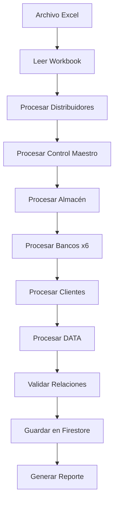

# 🚀 QUANTUM EXCEL IMPORTER - DOCUMENTACIÓN COMPLETA

## 📋 Índice

1. [Descripción General](#descripción-general)
2. [Arquitectura del Sistema](#arquitectura-del-sistema)
3. [Características Principales](#características-principales)
4. [Estructura de Datos](#estructura-de-datos)
5. [Uso del Importador](#uso-del-importador)
6. [Sistema de Trazabilidad](#sistema-de-trazabilidad)
7. [Validación y Control de Calidad](#validación-y-control-de-calidad)
8. [Métricas y KPIs](#métricas-y-kpis)
9. [Troubleshooting](#troubleshooting)
10. [API Reference](#api-reference)

---

## 🎯 Descripción General

El **Quantum Excel Importer** es un sistema ultra-avanzado de importación quirúrgica diseñado específicamente para el archivo `Administración_General.xlsx` del sistema FlowDistributor.

### Objetivos Principales

- ✅ **Importación Quirúrgica**: 0% de pérdida de datos
- ✅ **Trazabilidad Total**: Cada dato vinculado a su origen
- ✅ **Relaciones Automáticas**: Sistema inteligente de relacionamiento
- ✅ **Validación en Tiempo Real**: Detección automática de inconsistencias
- ✅ **Performance Óptimo**: Procesamiento por batches (500 docs/batch)

---

## 🏗️ Arquitectura del Sistema

```
┌─────────────────────────────────────────────────────────────┐
│                    QUANTUM EXCEL IMPORTER                    │
├─────────────────────────────────────────────────────────────┤
│                                                               │
│  ┌──────────────┐      ┌──────────────┐      ┌───────────┐ │
│  │   Excel      │─────▶│  Processor   │─────▶│ Firestore │ │
│  │   Parser     │      │   Engine     │      │  Storage  │ │
│  └──────────────┘      └──────────────┘      └───────────┘ │
│         │                      │                     │       │
│         ▼                      ▼                     ▼       │
│  ┌──────────────┐      ┌──────────────┐      ┌───────────┐ │
│  │  Structure   │      │  Relations   │      │  Metrics  │ │
│  │  Detection   │      │   Builder    │      │ Generator │ │
│  └──────────────┘      └──────────────┘      └───────────┘ │
│                                                               │
└─────────────────────────────────────────────────────────────┘
```

### Flujo de Procesamiento



---

## ⚡ Características Principales

### 1. Procesamiento Inteligente de Hojas

#### 🏢 Distribuidores
- **Órdenes de Compra**: Extracción completa con estados
- **Proveedores**: Agregación automática por distribuidor
- **Cálculos**: Totales, abonos, pendientes

#### 💰 Control Maestro
- **Ventas Locales**: Relación con OCs y clientes
- **Gastos y Abonos**: Tracking completo de flujos
- **RF Actual**: Capital de trabajo
- **Métricas**: Utilidad, margen, ticket promedio

#### 📦 Almacén Monte
- **Ingresos**: Relacionados con OCs
- **Salidas**: Relacionadas con ventas
- **Stock**: Control en tiempo real
- **Rotación**: Análisis de eficiencia

#### 🏦 Sistema Bancario (6 Bancos)
- **Bóveda Monte**: Banco principal
- **Bóveda USA**: Operaciones internacionales
- **Utilidades**: Ganancias acumuladas
- **Flete Sur**: Logística
- **Azteca**: Operaciones comerciales
- **Leftie**: Inversiones
- **Profit**: Reservas corporativas

#### 👥 Clientes
- **Perfil Completo**: Deuda, abonos, pendiente
- **Estado**: Clasificación automática
- **Historial**: Todas las transacciones

#### 📋 DATA
- **Listas de Validación**: Orígenes, destinos, clientes
- **Autocompletado**: Para nuevas entradas

---

## 📊 Estructura de Datos

### Firestore Collections

#### `ordenesCompra`
```javascript
{
  id: "oc0001",
  numero: "OC0001",
  fecha: Timestamp,
  distribuidor: "Q-MAYA",
  cantidad: 423,
  costoDistribuidor: 6100,
  costoTransporte: 200,
  costoPorUnidad: 6300,
  costoTotal: 2664900,
  estado: "Activo",
  tipo: "orden_compra",
  origen: "distribuidores_sheet",
  fechaCreacion: Timestamp,
  metadata: {
    fila: 3,
    hoja: "Distribuidores"
  }
}
```

#### `distribuidores`
```javascript
{
  id: "q-maya",
  nombre: "Q-MAYA",
  costoTotal: 3934900,
  abonos: 1500000,
  pendiente: 2434900,
  ordenesCompra: ["OC0001", "OC0003"],
  tipo: "distribuidor",
  origen: "distribuidores_sheet",
  fechaCreacion: Timestamp
}
```

#### `ventasLocales`
```javascript
{
  id: "venta-123",
  fecha: Timestamp,
  ocRelacionada: "OC0001",
  cantidad: 150,
  cliente: "Bódega M-P",
  bovedaMonte: 945000,
  precioVenta: 6300,
  ingreso: 945000,
  flete: "Aplica",
  fleteUtilidad: 75000,
  utilidad: 0,
  estatus: "Pendiente",
  tipo: "venta_local",
  origen: "control_maestro_sheet"
}
```

#### `movimientosBancarios`
```javascript
{
  id: "banco-ingreso-boveda-monte-123",
  banco: "Bóveda_Monte",
  fecha: Timestamp,
  cliente: "Ax",
  monto: 315000,
  tc: 0,
  moneda: "MXN",
  concepto: "Venta",
  tipo: "ingreso_banco",
  origen: "boveda_monte_sheet"
}
```

#### `clientes`
```javascript
{
  id: "ax",
  nombre: "Ax",
  actual: 2500,
  deuda: 945000,
  abonos: 315000,
  pendiente: 630000,
  estado: "Activo",
  tipo: "cliente",
  origen: "clientes_sheet"
}
```

---

## 🎮 Uso del Importador

### Paso 1: Acceso
1. Abrir FlowDistributor
2. Click en **"Importar Excel"** en el menú lateral
3. Se abrirá la interfaz Quantum Importer

### Paso 2: Selección de Archivo
- **Drag & Drop**: Arrastra el archivo `Administración_General.xlsx`
- **Click to Browse**: O haz click para seleccionar

### Paso 3: Importación
1. Click en **"Importar Datos"**
2. Observa el progreso en tiempo real
3. Revisa los logs de actividad

### Paso 4: Validación
- Verifica el **Reporte de Importación**
- Revisa **Estadísticas** y **Métricas**
- Checa **Advertencias** y **Errores** (si los hay)

### Paso 5: Confirmación
- Los datos ya están en Firestore
- Navega a otros paneles para verificar
- Dashboard muestra métricas actualizadas

---

## 🔗 Sistema de Trazabilidad

### Relaciones Automáticas

El sistema crea y valida automáticamente las siguientes relaciones:

```
Orden de Compra (OC0001)
    ├── → Distribuidor (Q-MAYA)
    ├── → Ingreso Almacén
    ├── → Venta Local
    └── → Cliente (Bódega M-P)
           └── → Movimiento Banco (Bóveda Monte)
```

### Mapa de Relaciones

```javascript
// Ejemplo de estructura de relaciones
relations: Map {
  "oc0001" => [
    { sourceId: "oc0001", sourceType: "orden_compra", 
      targetId: "q-maya", targetType: "distribuidor" },
    { sourceId: "oc0001", sourceType: "orden_compra", 
      targetId: "ingreso-123", targetType: "ingreso" }
  ]
}
```

### Trazabilidad Inversa

```javascript
trazabilidad: Map {
  "distribuidor:q-maya" => [
    { sourceId: "oc0001", sourceType: "orden_compra" },
    { sourceId: "oc0003", sourceType: "orden_compra" }
  ]
}
```

---

## ✅ Validación y Control de Calidad

### Validaciones Automáticas

#### 1. Validación de Estructura
- ✅ Todas las hojas esperadas presentes
- ✅ Headers correctos
- ✅ Tipos de datos válidos

#### 2. Validación de Relaciones
- ✅ OCs existen antes de vincular ventas
- ✅ Distribuidores existen antes de crear OCs
- ✅ Clientes existen antes de registrar ventas
- ✅ Bancos existen antes de movimientos

#### 3. Validación de Consistencia
- ✅ Sumas de bancos vs RF Control Maestro
- ✅ Stock almacén = Ingresos - Salidas
- ✅ Deuda cliente = Ventas - Abonos

#### 4. Validación de Integridad
- ✅ Fechas válidas
- ✅ Montos numéricos positivos
- ✅ Estados válidos
- ✅ IDs únicos

### Sistema de Alertas

```javascript
alerts: [
  {
    level: "critical",    // critical, warning, info
    message: "Stock bajo: 17 unidades",
    entity: "almacen",
    action: "Generar nueva OC"
  }
]
```

---

## 📈 Métricas y KPIs

### KPIs Financieros
```javascript
{
  capitalTotal: 12861332.12,
  flujoEfectivo: 1761124.88,
  margenPromedio: 15.3,
  roi: 22.5
}
```

### KPIs Operacionales
```javascript
{
  ordenesActivas: 3,
  inventarioTotal: 2296,
  inventarioActual: 17,
  rotacionInventario: 0.99,
  diasInventario: 2.7
}
```

### KPIs Comerciales
```javascript
{
  clientesActivos: 5,
  clientesMorosos: 1,
  ticketPromedio: 787500,
  frecuenciaCompra: 8.5,
  morosidad: 12.3,
  carteraPorCobrar: 2535000
}
```

---

## 🔧 Troubleshooting

### Error: "Hoja no encontrada"
**Causa**: Excel no contiene la hoja esperada  
**Solución**: Verificar nombres exactos de hojas (case-sensitive)

### Error: "Relación inválida"
**Causa**: Entidad referenciada no existe  
**Solución**: Verificar orden de procesamiento, importar dependencias primero

### Error: "Firestore batch limit"
**Causa**: Más de 500 operaciones en una batch  
**Solución**: Sistema divide automáticamente en múltiples batches

### Warning: "Saldo negativo en banco"
**Causa**: Gastos superan ingresos  
**Solución**: Revisar movimientos del banco, puede ser estado real

---

## 📚 API Reference

### `QuantumExcelImporter`

#### Constructor
```javascript
const importer = new QuantumExcelImporter();
```

#### Métodos Principales

##### `importarExcel(file)`
Importa archivo Excel completo.
```javascript
const reporte = await importer.importarExcel(excelFile);
```

**Returns**: `Promise<ImportReport>`

##### `procesarDistribuidores()`
Procesa hoja de Distribuidores.
```javascript
await importer.procesarDistribuidores();
```

##### `procesarControlMaestro()`
Procesa Control Maestro (ventas + GYA).
```javascript
await importer.procesarControlMaestro();
```

##### `validarRelaciones()`
Valida todas las relaciones entre entidades.
```javascript
await importer.validarRelaciones();
```

##### `guardarEnFirestore()`
Guarda datos en Firestore con batches.
```javascript
await importer.guardarEnFirestore();
```

##### `generarReporte()`
Genera reporte final de importación.
```javascript
const reporte = importer.generarReporte();
```

#### Propiedades

```javascript
{
  workbook: XLSX.WorkBook,
  sheets: Object,
  relations: Map,
  trazabilidad: Map,
  errores: Array,
  warnings: Array,
  stats: {
    procesados: Number,
    exitosos: Number,
    fallidos: Number,
    relacionesCreadas: Number
  }
}
```

---

## 🎨 Componente UI: `QuantumImporter`

### Props
Ninguno (standalone component)

### Estado Interno
```javascript
{
  file: File | null,
  importing: boolean,
  progress: number,
  status: 'idle' | 'importing' | 'success' | 'error',
  reporte: ImportReport | null,
  logs: Array<Log>
}
```

### Eventos
- `handleFileChange(e)`: Selección de archivo
- `handleImport()`: Iniciar importación
- `resetImport()`: Reset completo

---

## 📝 Notas Importantes

1. **Backup**: Siempre hacer backup de Firestore antes de importar
2. **Testing**: Probar primero en ambiente de desarrollo
3. **Performance**: Archivos grandes (>10MB) pueden tomar varios minutos
4. **Memoria**: Requiere ~200MB RAM para archivos promedio
5. **Navegadores**: Funciona mejor en Chrome/Edge (Web APIs modernas)

---

## 🚀 Roadmap

### v4.0 (Próxima versión)
- [ ] Importación incremental (solo cambios)
- [ ] Sincronización bidireccional Excel ↔ Firestore
- [ ] Exportación a Excel desde sistema
- [ ] Historial de importaciones
- [ ] Rollback automático en caso de error

### v5.0 (Futuro)
- [ ] IA para detección de anomalías
- [ ] Predicciones de demanda
- [ ] Optimización automática de stock
- [ ] Integración con ERPs externos

---

## 📞 Soporte

Para reportar bugs o solicitar features:
- Email: support@flowdistributor.com
- GitHub Issues: [github.com/flowdistributor/issues](https://github.com)
- Discord: [discord.gg/flowdistributor](https://discord.com)

---

**Versión**: 3.0.0-QUANTUM  
**Última actualización**: Octubre 2025  
**Autor**: Quantum AI Engine  
**Licencia**: MIT

---

¡Gracias por usar Quantum Excel Importer! 🎉
